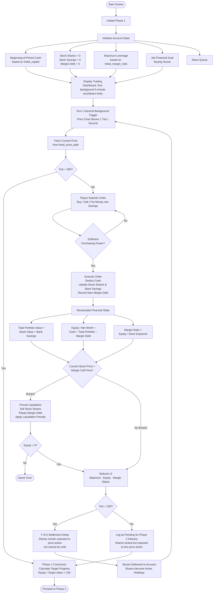

# FEATURE_MAP.md

## 1. Purpose

This document defines the **Week 5 feature structure of Free Fall 2.0**, translating the financial logic developed in Weeks 1–4 into a clear and usable product experience.

The feature map answers three questions:

| Dimension | Classification | Purpose |
|---|---|---|
| **Feature Role** | Main / Supporting | Identifies whether a feature directly delivers the core user task or supports its usability and understanding |
| **MVP Priority** | Core / Optional / Out of Scope | Determines whether the feature is required for the working MVP |
| **Implementation Decision** | Keep / Postpone / Remove | Defines what the team will actually build within the current development scope |

> **Important:** Feature Role and MVP Priority are different concepts.  
> A **Supporting Feature** may still be **Core** if the user cannot complete or understand the main task without it.

### Week 5 Focus

The purpose is not to redefine the financial model, but to connect the existing logic into a complete user-facing loop:

**User Goal → Input → Action → Financial Process → Output → Explanation → Next Action**

The feature map therefore focuses on:

- what the user can do;
- what the system must calculate;
- what information must be visible;
- what happens when risk increases;
- what feedback the user receives;
- which features are required for the MVP;
- which features should be postponed or removed.

## 2. Core User Goal

> Manage a leveraged stock portfolio through a 30-minute simulated market session, pursue a selected property target, and avoid forced liquidation by controlling leverage, liquidity, and exposure under market stress.

The product should allow the user to:

1. understand the assigned starting condition;
2. choose a financial target;
3. select a leverage level;
4. trade simulated assets;
5. monitor portfolio and margin health;
6. react to deteriorating risk before a maintenance breach;
7. experience the financial consequence of the chosen strategy;
8. understand the final result and why it occurred.

## 3. Main Feature

### Real-Time Leveraged Market Survival Simulation

The **main feature** is the interactive market simulation itself.

The user manages a portfolio across a deterministic **1,800-second trading session** consisting of **6 market phases**.

The core interaction loop is:

`Market Event → User Decision → Portfolio Revaluation → Risk State → Financial Consequence → User Feedback → Next Decision`

If this feature is removed, the product can no longer fulfill its core user task.

## 4. Feature Decision Map

| Feature | Feature Role | MVP Priority | User Purpose | System Function | Decision |
|---|---|---:|---|---|---:|
| **Scenario & Capital Assignment** | Supporting | Core | Understand the starting condition | Randomly assigns Scenario 1 or 2, sets starting capital, and locks the deterministic price path | **Keep** |
| **House Target Selection** | Supporting | Core | Choose financial objective and difficulty | Sets the property target and required wealth multiplier | **Keep** |
| **Margin Tier Selection** | Supporting | Core | Choose desired leverage capacity | Allows Cash 1.0x, 2x, 3x, or 4x margin tier | **Keep** |
| **1,800s Market Simulation** | Main | Core | Experience changing market conditions | Runs deterministic prices across 6 phases | **Keep** |
| **Market Phase & News Feed** | Supporting | Core | Understand why market conditions are changing | Displays phase-specific fake/real news and market events | **Keep** |
| **Asset Selection** | Supporting | Core | Choose an asset to trade | Displays available tradable assets and current prices | **Keep** |
| **Order Entry** | Main | Core | Execute trading decisions | Accepts Buy / Sell / Hold actions and trade quantity | **Keep** |
| **Order Validation** | Supporting | Core | Prevent invalid actions | Checks quantity, holdings, and available purchasing power before execution | **Keep** |
| **Order Execution** | Main | Core | Convert decisions into portfolio changes | Updates holdings, cash, exposure, and margin debt | **Keep** |
| **Portfolio Valuation** | Supporting | Core | Understand current portfolio position | Calculates current portfolio value and Gross Exposure | **Keep** |
| **Net Equity Tracking** | Supporting | Core | Measure actual remaining wealth | Calculates Net Equity after cash, exposure, and debt | **Keep** |
| **Effective Leverage Monitoring** | Supporting | Core | Understand current borrowing risk | Continuously calculates Effective Leverage | **Keep** |
| **Margin Health Indicator** | Supporting | Core | Understand account safety | Converts leverage / margin ratio into Safe, Warning, or Breach state | **Keep** |
| **Pre-Liquidation Warning** | Supporting | Core | Allow voluntary risk reduction before breach | Displays an active warning when leverage enters the danger zone | **Keep** |
| **Forced Liquidation Engine** | Main | Core | Enforce excessive leverage consequence | Automatically liquidates open equity positions when the maintenance threshold is breached | **Keep** |
| **Solvency Check** | Supporting | Core | Determine whether the player remains financially viable | Checks remaining Net Equity after liquidation | **Keep** |
| **Cash / Liquidity Display** | Supporting | Core | Monitor available financial flexibility | Shows current liquid cash balance | **Keep** |
| **Bank Savings** | Supporting | Core | Preserve funds outside market exposure while earning a safe simulated return | Allows deposit/withdrawal and automatically credits **+4.75% after each completed AM/PM session** | **Keep** |
| **Property Target Progress** | Supporting | Core | Track progress toward the selected goal | Calculates Net Equity relative to Property Target Value | **Keep** |
| **Recent Order Log** | Supporting | Core | Understand recent actions and execution | Displays recent trades, prices, and quantities | **Keep** |
| **Post-Simulation Risk & Decision Review** | Supporting | Core | Understand final financial outcome | Summarizes wealth, leverage, liquidation status, target result, and key decisions | **Keep** |
| **Scenario Playback** | Supporting | Optional | Review the sequence of previous decisions | Replays historical market events and player actions | **Postpone** |
| **Detailed Behavioral Classification** | Supporting | Optional | Identify possible behavioral patterns | Classifies observable behaviors such as FOMO or panic selling | **Postpone** |
| **Advanced Performance Charts** | Supporting | Optional | Analyze performance over time | Displays equity, leverage, drawdown, or portfolio-history charts | **Postpone** |
| **Leaderboard** | Supporting | Optional | Compare players | Ranks player results across sessions | **Remove from MVP** |
| **User Account / Login** | Supporting | Optional | Save player history | Stores profile and previous game results | **Remove from MVP** |
| **Export Result** | Supporting | Optional | Share or save results | Exports a simulation summary | **Postpone** |
| **Order-Book Depth** | Supporting | Out of Scope | Model exchange microstructure | Simulates order queues and market depth | **Remove** |
| **Execution Slippage Model** | Supporting | Out of Scope | Model liquidity-dependent execution cost | Adjusts trade prices based on simulated liquidity | **Remove** |
| **Derivative / Option Trading** | Supporting | Out of Scope | Hedge downside risk | Adds options, futures, or other derivatives | **Remove** |
| **Multiplayer Mode** | Supporting | Out of Scope | Compete with other players | Adds real-time multiplayer sessions | **Remove** |
| **Live Brokerage Integration** | Supporting | Out of Scope | Connect to real financial markets | Links the simulator to real-money brokerage infrastructure | **Remove** |

## 5. Core User-Facing Feature Flow

The core user-facing flow follows the existing **Phase 1 system architecture**. Phase 1 operates through a **5-minute (300-second) countdown**, while market prices update automatically every second according to the assigned scenario's `fixed_price_path`.

### Flow Breakdown

| Stage | Core Process | System Result |
|---|---|---|
| **1. Setup** | Initialize capital, shares, savings, margin debt, maximum leverage, and financial goal | Starting account state |
| **2. Market Simulation** | Run the 5-minute timer and update prices every second using `fixed_price_path` | Live market state |
| **3. Player Decision** | Buy, Sell, or Put Money into Savings | Order submitted |
| **4. Validation** | Check sufficient purchasing power | Reject or execute order |
| **5. Portfolio Update** | Update cash, stock shares, bank savings, and margin debt | New portfolio state |
| **6. Financial Calculation** | Calculate Total Portfolio Value, Equity / Net Worth, and Margin Ratio | Updated financial metrics |
| **7. Margin Check** | Compare Current Stock Price with Margin Call Price | Normal state or liquidation |
| **8. Forced Liquidation** | Sell shares, repay margin debt, and apply liquidation penalty | Updated Equity |
| **9. Solvency Check** | Check whether Equity remains positive | Continue or Game Over |
| **10. Settlement** | Apply T+0.5 settlement treatment | Active Holdings or Pending Phase 2 Delivery |
| **11. Savings Accrual** | Credit **+4.75%** to Bank Savings after each completed AM/PM session | Updated Bank Savings balance |
| **12. Phase Conclusion** | Calculate `Equity / Target Value × 100` | Target Progress |
| **13. Transition** | Complete Phase 1 | Proceed to Phase 2 |

> **Background process:** The News Queue and 1-second price trigger operate automatically throughout Phase 1. Stock prices follow the scenario's predetermined `fixed_price_path`, including while purchased shares are waiting for settlement.
