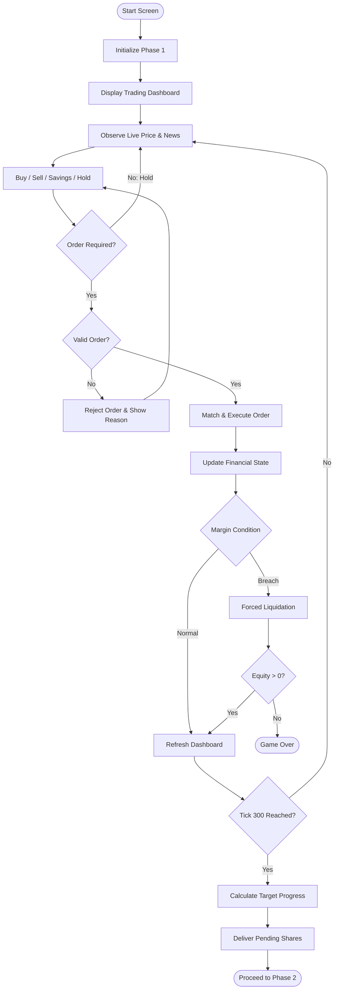
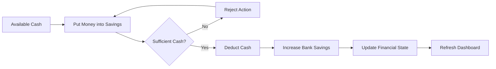
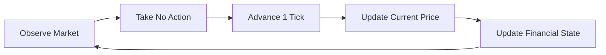
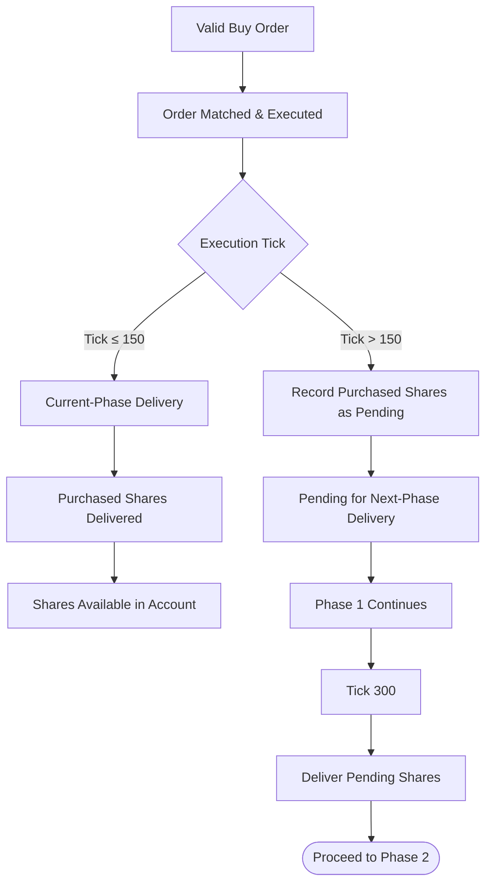
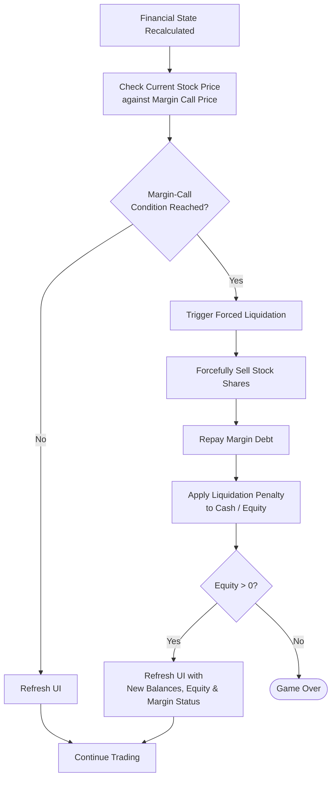
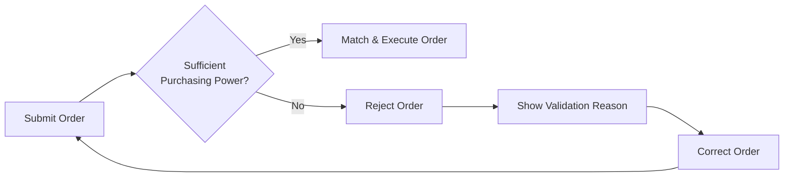

# USER_FLOW.md

## 1. Purpose and Flow Scope

This document defines how users interact with **Free Fall 2.0** from the beginning of Phase 1 to the next phase or a terminal state.

It translates the features defined in `FEATURE_MAP.md` into reviewable user journeys by showing:

| Dimension | Purpose |
|---|---|
| **User Action** | What the player does |
| **System Response** | How the simulation reacts |
| **Evidence** | What becomes visible on the interface |
| **Next State** | Where the interaction leads |

The document covers three required types of user flow:

- **Happy Path** — normal valid interaction;
- **Alternative Paths** — valid user choices that create different outcomes;
- **Error & Critical-Risk Paths** — invalid actions, forced liquidation, and terminal states.

### Current Flow Scope

The detailed implementation below focuses on **Phase 1**:

- Duration: **5 minutes / 300 ticks**
- Market update: **1 tick per second**
- Price source: assigned scenario's `fixed_price_path`
- Available actions: **Buy / Sell / Put Money into Savings / Hold**
- Settlement rule: **T+0.5**
- Phase output: **Target Progress**
- Next state: **Phase 2 or Game Over**

## 2. High-Level User Journey

The Phase 1 user journey can be summarized as:

**Start → Initialize Account → Enter Dashboard → Observe Market → Submit Action → Validate → Execute → Update Financial State → Evaluate Margin Risk → Continue / Liquidate → Calculate Target Progress → Proceed to Phase 2**

# 3. Happy Path — Normal Phase 1 Trading

The Happy Path occurs when the user begins Phase 1, monitors the market and News Queue, submits valid transactions during the 5-minute period, remains solvent, and reaches the end of the phase.

## 3.1 Detailed Happy Path

| Step | User Action | System Response | Evidence |
|---:|---|---|---|
| **1** | Click Start Screen | Initiate Phase 1 and start the 5-minute countdown timer | Phase 1 started + timer |
| **2** | — | Set Stock Shares = 0, Bank Savings = 0, Margin Debt = 0 | Initial balances |
| **3** | — | Set Beginning-of-Period Cash based on `initial_capital` | Beginning Cash |
| **4** | — | Set Maximum Leverage based on `initial_margin_ratio` | Maximum Leverage |
| **5** | — | Set Financial Goal — Buying House | Financial Goal displayed |
| **6** | — | Display the trading dashboard and immediately start the live price feed and News Queue | Trading dashboard + live price + news |
| **7** | Monitor market and news | Advance the simulation by 1 tick per second and update Current Stock Price from `fixed_price_path` | Live price chart + current tick |
| **8** | Submit Buy / Sell / Put Money into Savings at any time within the 5-minute phase | Receive the order and check whether sufficient purchasing power is available | Order validation |
| **9** | Submit a valid order | Match the order | Order matched |
| **10A** | Buy order matched at Tick ≤ 150 | Execute the order; purchased shares are delivered during the current phase | Executed order + shares received |
| **10B** | Buy order matched at Tick > 150 | Execute the order; purchased shares are recorded as pending and delivered in the next phase | Executed order + pending shares |
| **11** | — | Update Cash, Stock Shares, Bank Savings, and Margin Debt according to the transaction and share-delivery status | Updated balances |
| **12** | — | Recalculate Total Portfolio Value, Equity / Net Worth, and Margin Ratio | Updated financial state |
| **13** | — | Check Current Stock Price against Margin Call Price | Margin Status |
| **14** | — | Refresh the UI with updated balances, Equity, and Margin Status | Updated dashboard |
| **15** | Continue monitoring and trading | Continue the 1-second market update process | Live dashboard |
| **16** | — | Continue until Tick 300 | 300 ticks completed |
| **17** | — | Calculate Phase 1 Target Progress = `Equity / Target Value × 100` | Phase 1 conclusion |
| **18** | — | Deliver any pending shares from late-phase orders and proceed to Phase 2 | Phase 2 |

## 3.2 Happy Path Interaction Loop

During the active trading period, Steps 7–15 form a repeating interaction loop:

`Observe Market → Submit Action → Validate → Execute → Update Balances → Recalculate Financial State → Check Margin Status → Refresh UI → Observe Market`

The loop continues until:

- Tick 300 is reached;
- forced liquidation occurs and the player becomes insolvent; or
- another terminal state defined by the simulation is reached.

# 4. Alternative Paths

Alternative Paths represent **valid user behavior** that differs from the normal trading route.

They are not system errors.

## 4.1 Alternative Action Map

| Path | User Action | System Response | Evidence |
|---|---|---|---|
| **A1 — Different Asset / Volume** | Buy a different stock or different volume | Match the order and update the corresponding financial state | Different holdings |
| **A2 — Sell Position** | Sell an existing active position | Match the Sell order and update Cash and Stock Shares | Updated position |
| **A3 — Savings** | Put money into Savings | Transfer the selected amount into Bank Savings | Updated Savings |
| **A4 — Hold** | Submit no order | Continue the market simulation automatically | Unchanged position + changing market price |
| **A5 — Multiple Orders** | Submit multiple orders during the phase | Process each order according to the current simulation tick | Order history |
| **A6 — Continue Monitoring** | Continue observing the market after an order | Continue updating market prices and financial state every second | Live dashboard |
| **A7 — Late Buy** | Submit a Buy order after Tick 150 | Execute the order but hold the purchased shares for next-phase delivery | Pending shares status |

## 4.2 Savings Path

The player may choose to transfer available Cash into Bank Savings instead of increasing stock exposure.

| User Action | System Response | Evidence | Next State |
|---|---|---|---|
| Select Savings action | Request savings amount | Savings input |
| Submit valid amount | Deduct Cash and increase Bank Savings | Updated Cash + Savings |
| Hold Savings | Include Bank Savings in Total Portfolio Value | Updated portfolio state | Continue Phase 1 |

## 4.3 Hold Path

The player is not required to submit an order at every tick.

The user's holdings remain unchanged, but their market value may continue changing as the price feed advances.

## 4.4 Multiple-Order Path

The player may submit multiple valid transactions during the same phase.

Each order is processed using the **current simulation tick and current market state**.

`Order 1 → Execute → Update State → Continue Market → Order 2 → Execute → Update State → ...`

Each completed order should appear in the user's **Order History**.

# 5. T+0.5 Settlement Path

Buy orders follow the existing Phase 1 settlement rule.

## 5.1 Order Timing Rule

> **Tick ≤ 150** → Buy order is matched and executed; purchased shares are delivered during the current phase.

> **Tick > 150** → Buy order is matched and executed; purchased shares are delivered in the next phase.

## 5.2 Settlement Flow

## 5.3 Settlement Evidence

| Order Timing | System Treatment | User Evidence |
|---|---|---|
| **Tick ≤ 150** | Purchased shares are delivered during Phase 1 | Shares received in current phase |
| **Tick > 150** | Purchased shares are recorded as pending | Pending Shares status |
| **Phase Transition** | Pending shares are delivered before / as the system proceeds to Phase 2 | Updated holdings in Phase 2 |

# 6. Margin-Risk and Forced-Liquidation Path

The margin-risk branch is evaluated after the financial state is recalculated.

The system checks **Current Stock Price against Margin Call Price**.

If the margin-call condition is reached, liquidation is automatic.

## 6.1 Liquidation Sequence

| Step | User State / Action | System Response | Evidence |
|---:|---|---|---|
| **L1** | User holds leveraged Stock Shares | Continuously recalculate financial state | Current Margin Status |
| **L2** | Current Stock Price reaches Margin Call Price | Enter margin-risk branch | Margin Call condition |
| **L3** | — | Trigger forced liquidation automatically | Forced Liquidation |
| **L4** | — | Forcefully sell Stock Shares | Holdings reduced / closed |
| **L5** | — | Repay Margin Debt | Updated Margin Debt |
| **L6** | — | Apply liquidation penalty to Cash / Equity | Updated Cash / Equity |
| **L7** | — | Check whether Equity remains positive | Solvency status |
| **L8A** | Equity > 0 | Refresh UI and continue the simulation | Updated dashboard |
| **L8B** | Equity ≤ 0 | End the game | Game Over |

> Once forced liquidation is triggered, it is a **system action**. The user does not receive an additional manual response period after the liquidation condition has been reached.

# 7. Error and Recovery Paths

Error Paths represent invalid user actions that prevent the requested transaction from being completed normally.

Where recovery is possible, the interface should:

**Reject → Explain → Allow Correction → Retry**

## 7.1 Order Error Map

| Error Case | Trigger | System Response | Evidence | Recovery |
|---|---|---|---|---|
| **Insufficient Purchasing Power** | Order exceeds available purchasing capacity | Do not complete the transaction | Order Rejected / Purchasing-Power Validation | Reduce order size or choose another action |
| **Invalid Order Quantity** | Quantity is empty, zero, negative, or invalid | Do not submit the transaction | Inline quantity error | Enter a valid quantity |
| **Insufficient Cash for Savings** | Savings amount exceeds available Cash | Reject Savings action | Insufficient Cash message | Reduce savings amount |
| **Sell Exceeds Available Shares** | Sell quantity exceeds available shares | Reject Sell order | Insufficient Shares message | Reduce Sell quantity |
| **Unavailable / Pending Shares** | User attempts to sell shares not yet available for sale under the settlement process | Do not execute Sell order | Pending Shares status | Wait for delivery |

## 7.2 Purchasing-Power Error Flow

## 7.3 Invalid Input Recovery

For recoverable input errors:

| User Problem | Interface Response | Next Action |
|---|---|---|
| Empty quantity | Highlight quantity field | Enter quantity |
| Quantity ≤ 0 | Show valid-range message | Correct quantity |
| Order exceeds purchasing power | Show available capacity | Reduce order |
| Savings amount exceeds Cash | Show available Cash | Reduce amount |
| Sell quantity exceeds available shares | Show available shares | Reduce Sell quantity |
| Shares pending delivery | Show Pending status | Wait until delivery |

The interface should explain **why** an action failed rather than only displaying a generic error.

# 8. Critical Risk vs. User Error

A margin call or forced liquidation should not be treated as an ordinary input error.

The distinction is:

| Type | Cause | Example | System Behavior |
|---|---|---|---|
| **User Input Error** | Invalid or infeasible submitted action | Insufficient purchasing power | Reject and allow retry |
| **Valid Alternative Path** | Valid user choice | Hold / Savings / Late Buy | Process normally |
| **Critical Risk Event** | Financial state reaches a defined risk condition | Margin Call Price reached | Trigger forced liquidation |
| **Terminal State** | Player becomes insolvent | Equity ≤ 0 | Game Over |

This distinction ensures that the user flow separates **invalid interaction** from **valid decisions with adverse financial consequences**.

# 9. Output Explanation Framework

A system output should not only show a number or status. It should help the user understand what happened and what the result means.

For important financial and risk outputs, the interface should follow:

**Result → Reason → Meaning → Next Action**

## 9.1 Example — Normal Financial State

**Result:**  
`Equity / Net Worth: $XX,XXX`

**Reason:**  
Calculated from Cash, Total Portfolio Value, and Margin Debt.

**Meaning:**  
Represents the player's current remaining financial wealth.

**Next Action:**  
Continue monitoring the market and adjust exposure if necessary.

## 9.2 Example — Pending Shares

**Result:**  
`Pending Shares`

**Reason:**  
The Buy order was matched after Tick 150.

**Meaning:**  
The shares have been executed but are scheduled for next-phase delivery.

**Next Action:**  
Continue monitoring the market and wait for delivery.

## 9.3 Example — Order Rejected

**Result:**  
`Order Rejected`

**Reason:**  
The requested transaction exceeds available purchasing power.

**Meaning:**  
The account cannot support the submitted transaction.

**Next Action:**  
Reduce the order size or choose another action.

## 9.4 Example — Forced Liquidation

**Result:**  
`Forced Liquidation`

**Reason:**  
Current Stock Price reached the defined Margin Call Price.

**Meaning:**  
The system automatically sells Stock Shares to repay Margin Debt and applies the liquidation penalty.

**Next Action:**  
If Equity remains positive, review the updated account state and continue. If Equity is non-positive, the game ends.

# 10. User Flow Coverage Matrix

| Flow | Classification | Start State | Main Action / Condition | End State | Main Evidence |
|---|---|---|---|---|---|
| **Normal Trading** | Happy Path | Start Screen | Valid trading through Phase 1 | Proceed to Phase 2 | Dashboard + Target Progress |
| **Different Asset / Volume** | Alternative | Trading Dashboard | Change asset or trade size | Updated Portfolio | Different Holdings |
| **Sell Position** | Alternative | Active Holdings | Sell existing position | Updated Portfolio | Cash + Shares |
| **Savings** | Alternative | Available Cash | Put money into Savings | Updated Portfolio | Bank Savings |
| **Hold** | Alternative | Trading Dashboard | Take no trading action | Continue Phase | Live Price |
| **Multiple Orders** | Alternative | Trading Dashboard | Submit multiple valid orders | Continue Phase | Order History |
| **Late Buy** | Alternative | Tick > 150 | Execute Buy order | Pending Delivery | Pending Shares |
| **Insufficient Purchasing Power** | Error | Order Entry | Submit oversized order | Return to Order Entry | Rejection Message |
| **Invalid Quantity** | Error | Order Entry | Submit invalid quantity | Return to Order Entry | Inline Error |
| **Insufficient Savings Cash** | Error | Savings Entry | Save more than available Cash | Return to Savings Entry | Error Message |
| **Sell Exceeds Shares** | Error | Sell Entry | Sell more than available | Return to Order Entry | Error Message |
| **Margin Call** | Critical Risk | Leveraged Position | Margin Call Price reached | Forced Liquidation | Margin / Liquidation Status |
| **Post-Liquidation Solvency** | Critical Risk | Forced Liquidation | Equity > 0 | Continue Simulation | Updated Dashboard |
| **Insolvency** | Terminal | Forced Liquidation | Equity ≤ 0 | Game Over | Game Over Screen |

# 11. Flow Audit

The user flow should satisfy the following Week 5 review questions:

| Review Question | Current Flow |
|---|---|
| **Does the user have a clear starting point?** | Yes — Start Screen |
| **Does the system visibly initialize the simulation?** | Yes — timer, balances, leverage, goal, dashboard |
| **Can the user observe the market before acting?** | Yes — live price feed and News Queue |
| **Can the user perform the required core actions?** | Yes — Buy, Sell, Savings, or Hold |
| **Are submitted orders validated?** | Yes — purchasing-power and order validation |
| **Does every valid transaction update the financial state?** | Yes — Cash, Shares, Savings, Margin Debt, Portfolio Value, Equity, and Margin Ratio |
| **Is settlement timing represented?** | Yes — Tick ≤ 150 and Tick > 150 follow different delivery timing |
| **Can the user understand current risk?** | Yes — Margin Status is refreshed after financial recalculation |
| **Is excessive leverage given a visible consequence?** | Yes — forced liquidation |
| **Is insolvency represented?** | Yes — Equity ≤ 0 results in Game Over |
| **Are alternative valid behaviors represented?** | Yes — different trades, Sell, Savings, Hold, multiple orders, and late Buy |
| **Can users recover from invalid inputs?** | Yes — recoverable errors are rejected with a reason and can be corrected |
| **Does Phase 1 have a clear ending?** | Yes — Target Progress is calculated at Tick 300 |
| **Does the flow lead to a clear next state?** | Yes — Phase 2 or Game Over |

# 12. User Flow Summary

### Happy Path

**Start → Initialize → Observe → Submit Valid Action → Execute → Update Financial State → Check Margin → Refresh UI → Complete Phase → Target Progress → Phase 2**

### Alternative Paths

**Savings:**  
`Cash → Savings → Update Bank Savings → Recalculate → Continue`

**Hold:**  
`Observe → No Order → Market Continues → Financial State Updates`

**Late Buy:**  
`Buy after Tick 150 → Execute → Pending Shares → Phase 2 Delivery`

**Multiple Orders:**  
`Order → Update State → Continue Market → New Order → Update State`

### Error Path

**Recoverable Error:**  
`Invalid Order → Reject → Explain → Correct → Retry`

### Critical-Risk Path

**Margin Call:**  
`Margin Call Condition → Forced Liquidation → Repay Margin Debt → Apply Penalty → Solvency Check`

### Terminal Path

**Insolvency:**  
`Equity ≤ 0 → Game Over`

---

## Core Interaction Principle

> **User Action → System Response → Visible Evidence → Financial Consequence → Next Action**
